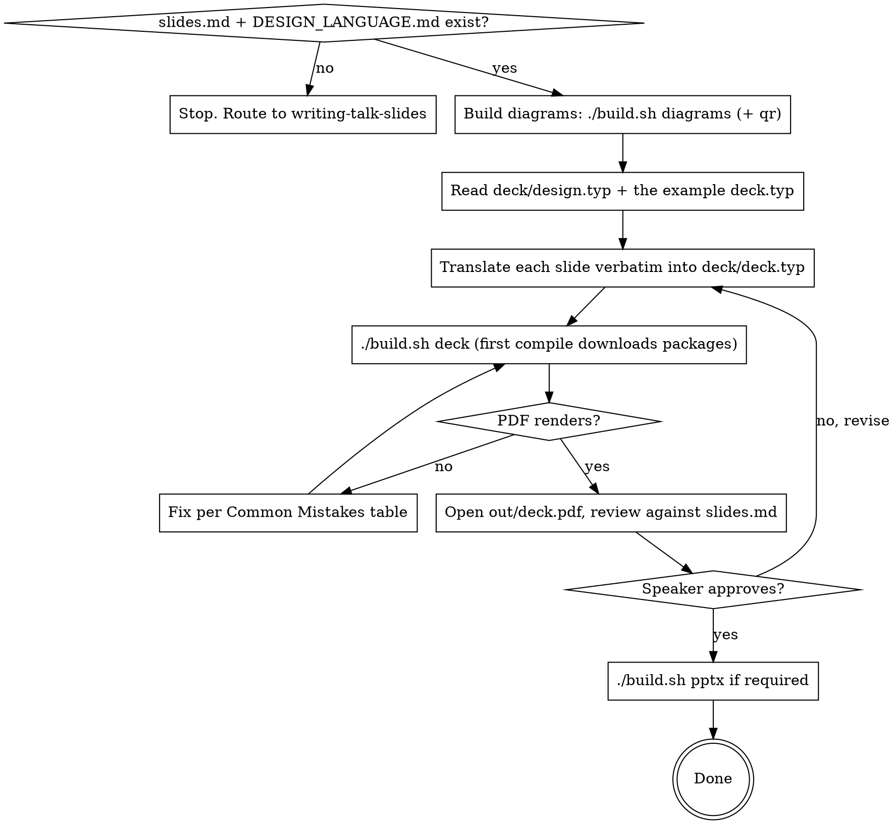

# Building Talk Decks with Typst + Touying

## Overview

Compile `slides.md` (per-slide spec) into a rendered PDF deck using Typst + Touying. The deck is the authoritative *visual* artifact; `slides.md` remains the spec. If pptx is required for conference delivery, the PDF is image-wrapped into a pptx at the end — the pptx is the deliverable, not the source.

**Why Typst + Touying** (over python-pptx, Marp, or hand-built PowerPoint):

- Multi-step diagrams render as **full-bleed reveal sequences** — one draw.io source, one PNG per build step, dropped into the deck with a tiny `for` loop. The click-through animation becomes a page sequence.
- Fast compile loop, real layout primitives, every figure traces back to a committed source.
- Tradeoff: pptx output is image-wrapped (non-editable). PDF is editable in Typst, not in PowerPoint.

## This skill is template-aware

The talk directory is a copy of the `_template`. The scaffolding **already exists** — you fill it in, you do not build it from scratch:

- `deck/deck.typ` — the deck (a worked example of every archetype is already there to adapt)
- `deck/design.typ` — palette / fonts / sizes / margins (mirrors `DESIGN_LANGUAGE.md`)
- `build.sh` — the build orchestrator (`./build.sh deck | pptx | concat | diagrams | qr | all`)
- `diagrams/build_diagrams.py` — turns `diagrams/*.drawio` into `figures/<stem>_NN.png` reveal frames
- `tools/wrap_to_pptx.py`, `tools/flatten_deck.py` — pptx wrap + handout flatten

Read `CLAUDE.md` and `diagrams/README.md` first. Do not invent a parallel build system, a python-pptx deck builder, or a new figure pipeline.

## When to Use

- A validated `slides.md` exists (from `writing-talk-slides`) AND `DESIGN_LANGUAGE.md` exists.
- Speaker is moving from spec to rendered deck.

**Do NOT use** for:
- Writing or revising `slides.md` (use `writing-talk-slides`).
- Polishing in PowerPoint after the build (out of scope; rebuild instead).
- Talks where the venue requires *editable* pptx — the image-wrapped output won't satisfy that.

## Required Prior State

The talk directory must contain:

- `concept.md` — talk concept
- `DESIGN_LANGUAGE.md` — palette, typography, layout, slide types, don'ts
- `slides.md` — per-slide spec with Type / Visual / Layout / Speaker notes / Time
- `diagrams/*.drawio` for every diagram `slides.md` references (multi-step diagrams use the `lyr_*` reveal-layer convention). Build them to `figures/` with `./build.sh diagrams`.

If any of these are missing, stop and route to the upstream skill.

## Project Layout (already scaffolded)

```
talk/
  concept.md  slides.md  DESIGN_LANGUAGE.md  CLAUDE.md
  build.sh                       # ./build.sh deck|pptx|concat|diagrams|qr|all
  deck/
    deck.typ                     # the deck itself
    design.typ                   # design constants — mirrors DESIGN_LANGUAGE.md
  diagrams/
    build_diagrams.py            # draw.io reveal exporter
    *.drawio                     # one source per diagram (stem = figure prefix)
  tools/
    gen_qr.py  wrap_to_pptx.py  flatten_deck.py
  assets/                        # committed source images (logos, photos)
  figures/                       # GENERATED: diagram frames + QR (build output)
  out/                           # deck.pdf / deck.pptx (gitignored)
```

Never inline the palette, fonts, or sizes inside `deck.typ`. They live in `deck/design.typ` and are imported. The design doc is still the source of truth — `design.typ` is a translation, not a fork.

## Core Pattern — `design.typ`

`deck/design.typ` already mirrors `DESIGN_LANGUAGE.md`. Read it; don't recreate it. It exposes `palette`, `font`, `sizes`, `margins`:

```typst
// Mirrors DESIGN_LANGUAGE.md. If they drift, the design doc wins.
#let palette = ( /* black, white, navy, accent, mid-purple, light-grey, medium-grey, ... */ )
#let font = "Helvetica Neue"
#let sizes = ( headline: 36pt, body: 20pt, caption: 12pt, big-number: 140pt,
               divider-title: 56pt, statement: 40pt, title-large: 72pt, ... )
#let margins = ( top: ..., bottom: ..., left: ..., right: ... )
```

If a value you need isn't there, add it to `design.typ` (and `DESIGN_LANGUAGE.md`) — never hard-code it in `deck.typ`.

## Core Pattern — `deck.typ` header

```typst
#import "@preview/touying:0.6.1": *
#import themes.simple: *
#import "design.typ": palette, font, sizes, margins
// #import "@preview/cetz:0.3.4"   // only if you use the optional inline-diagram pattern

#show: simple-theme.with(
  aspect-ratio: "16-9",
  config-info(title: [Talk Title], author: [Speaker]),
  config-page(margin: margins, fill: palette.white),
  // CRITICAL: suppress theme chrome — almost every minimalist design doc forbids it
  progress-bar: false,
  footer: [],
  footer-right: [],
)

#set text(font: font, size: sizes.body, fill: palette.black)
```

Compile from the talk root (`./build.sh` handles this): `typst compile --root . deck/deck.typ out/deck.pdf`. The `--root .` lets full-bleed images resolve as `/figures/...` and `/assets/...`.

### The chrome-suppression incantations

`simple-theme` shows a progress bar AND a page counter ("3 / 12") by default. These violate any minimal design language. You need **all three** of these in `simple-theme.with(...)`:

- `progress-bar: false`
- `footer: []`
- `footer-right: []`

Just `footer: []` alone leaves the page counter. Just `progress-bar: false` alone leaves both footers.

## Core Pattern — Static Slides

### Title

```typst
#slide[
  #v(1.2fr)
  #text(size: sizes.title-large, weight: "regular")[Talk Title]
  #v(0.3em)
  #text(size: 18pt, weight: "light", fill: palette.medium-grey)[Subhead]
  #v(3fr)
]
```

### Section divider (full-bleed coloured page)

```typst
#let divider-slide(title, fill: palette.navy) = slide(
  config: config-page(fill: fill, margin: margins))[
  #set text(fill: palette.white)
  #align(center + horizon)[#text(size: sizes.divider-title, weight: "regular")[#title]]
]
#divider-slide("Section One")
```

### Big number

```typst
#slide[
  #v(1fr)
  #align(center, stack(
    spacing: 0.6em,
    text(size: sizes.big-number, weight: "bold")[5×],
    text(size: 16pt, weight: "light", fill: palette.medium-grey)[Caption],
  ))
  #v(1.4fr)
]
```

**Why `stack()` not raw `align(center)[...]`:** `align(center)[#text(big)[X] #v(0.6em) #text(cap)[Y]]` does NOT keep the caption near the number — `v()` inside `align` doesn't anchor as expected. Use `stack(spacing: ..., a, b)` to keep them visually adjacent.

### Statement

```typst
#slide[
  #v(1fr)
  #block(width: 75%)[
    #text(size: sizes.statement, weight: "regular")[
      One quotable sentence, left-aligned, surrounded by white space.
    ]
  ]
  #v(1.2fr)
]
```

## Core Pattern — Diagram with Progressive Reveals (PRIMARY)

This is the highest-value pattern in the deck, and the one this template is built around. The diagram lives in **draw.io**, not in Typst. `build_diagrams.py` exports one PNG per cumulative reveal layer (`figures/<stem>_NN.png`); the deck drops each frame onto its own full-bleed page.

```typst
// diagrams/<name>.drawio  ->  ./build.sh diagrams  ->  figures/<name>_NN.png
#let fullbleed(path) = slide(config: config-page(margin: 0cm, fill: palette.white))[
  #place(top + left, image(path, width: 100%, height: 100%))
]

// N reveal frames, one PDF page each:
#{
  for n in range(1, N + 1) {
    let nn = if n < 10 { "0" + str(n) } else { str(n) }
    fullbleed("/figures/<name>_" + nn + ".png")
  }
}
```

**Why this works:**
- One source of truth: the `.drawio`. Re-sequence the build by reordering layers in draw.io's Layers panel, then `./build.sh diagrams`. No Typst change.
- Bounds are pinned by the always-on `lyr_canvas` rect, so frames don't jitter between pages.
- Paths are root-absolute (`/figures/...`); the deck compiles with `--root .` (handled by `build.sh`).
- To show only a subset (e.g. zoom back out to the final two frames after a detour), loop a literal tuple instead: `for nn in ("14", "15") { fullbleed(...) }`.

See `diagrams/README.md` for the `lyr_*` layer naming/ordering convention and the recolour-frames variant.

### Optional — `cetz` for simple inline diagrams

For a *small* diagram that's faster to express in code than to draw (a few boxes and arrows on an otherwise-text slide), you can draw it inline with `cetz` and gate elements on Touying's `self.subslide` instead of exporting PNGs. This is the exception, not the default — reach for draw.io for anything that is the focus of a slide.

```typst
#import "@preview/cetz:0.3.4"

#let arch-canvas(step) = cetz.canvas({
  import cetz.draw: *
  let box(name, x, y, label, w: 2.4, h: 0.9) = {
    rect((x, y), (x + w, y + h), name: name, stroke: (paint: palette.black, thickness: 1pt))
    content((x + w/2, y + h/2), text(font: font, size: 11pt)[#label])
  }
  let arrow(from, to) = line(from, to, mark: (end: ">", fill: palette.black))

  if step >= 5 { rect((-0.4, 3.0), (12.4, 4.4), stroke: (paint: palette.light-grey)) }  // container, drawn first
  box("m1", 0, 0, [Machine 1])                                                          // step 1: always
  if step >= 2 { box("kafka", 3.8, 0.6, [Kafka]); arrow("m1.east", "kafka.west") }      // step 2+
  // ... step 3, 4, 5
})

#slide(repeat: 5, self => [
  #let s = self.subslide
  #align(center + horizon)[ #arch-canvas(s) ]
])
```

- `slide(repeat: N, self => [...])` produces N PDF pages from one source; `self.subslide` is the 1-based sub-page index.
- The closure form `self => [...]` is required to access `self`; the bracket form `slide[...]` does not expose it.
- Background containers must be drawn **before** foreground boxes (cetz paints in source order).

## Build

Use the orchestrator — never hand-roll a build:

```bash
./build.sh diagrams   # draw.io  -> figures/*.png   (run after editing any .drawio)
./build.sh deck       # deck/deck.typ -> out/deck.pdf
./build.sh pptx       # + out/deck.pptx (image-per-slide; delivery only, non-editable)
./build.sh concat     # flattened-reveals handout -> out/deck-concat.pdf
./build.sh all        # diagrams + deck
```

`tools/wrap_to_pptx.py` puts one full-bleed image per pptx slide; the pptx is non-editable but conference-deliverable. `tools/flatten_deck.py` (the `concat` target) collapses every reveal loop to its final frame for a printable handout.

## Faithful Translation of `slides.md`

Each slide in `slides.md` maps to exactly one `#slide[...]` block (or one full-bleed `for` loop for a reveal sequence). Headlines, body text, and captions come **verbatim** from the `Visual:` section of the spec. Do not paraphrase. Do not invent.

If `slides.md` says the headline is `"This talk is about everything this diagram doesn't show."`, that exact string appears in the Typst source. The spec is the contract.

## Common Mistakes

| Symptom | Fix |
|---|---|
| Page numbers visible bottom-right ("3 / 12") | Add `footer-right: []` in `simple-theme.with(...)`. `footer: []` alone is insufficient. |
| Progress bar visible at top | Add `progress-bar: false`. |
| Diagram frames jump/jitter between pages | The diagram's `lyr_canvas` layer needs an always-visible rect sized to the full diagram. See `diagrams/README.md`. |
| Reveal frames out of order, or a step appears too early/late | Reorder the layers in draw.io's Layers panel (reveal = document order), then `./build.sh diagrams`. Don't renumber filenames. |
| Image not found at compile | Run `./build.sh diagrams` (and `./build.sh qr`) first; confirm `/figures/<stem>_NN.png` exists and the deck compiles with `--root .`. |
| Big-number caption floats to the slide bottom | Replace `align(center)[#text(...) #v(...) #text(...)]` with `align(center, stack(spacing: ..., ..., ...))`. |
| `self.subslide` undefined (cetz path) | Use closure form: `#slide(repeat: N, self => [...])`. The bracket form `#slide[...]` doesn't expose `self`. |
| Headline wraps unexpectedly | Reduce point size (60pt instead of 72pt) or widen via `block(width: 95%)`. Headlines should sit on ≤ 2 lines; one is ideal. |
| Inventing colors / fonts / sizes in `deck.typ` | Stop. Open `deck/design.typ`. If it's not there, open `DESIGN_LANGUAGE.md`. |
| Touying package download fails | First compile fetches `@preview/touying` (and `@preview/cetz` if used). Re-run; the second compile uses the cache. |
| Helvetica Neue missing | On macOS it ships at `/System/Library/Fonts/HelveticaNeue.ttc`. Verify with `fc-list \| grep -i "helvetica neue"`. |

## Red Flags — STOP

| Thought | What it means |
|---|---|
| "I'll tweak the slide directly in the pptx" | The pptx is image-wrapped. Rebuild from Typst. |
| "I'll just pick a slightly different purple" | Open `DESIGN_LANGUAGE.md`. The palette is fixed. |
| "I'll paraphrase the headline to fit better" | Open `slides.md`. Strings are verbatim. If wrapping is the problem, change the size, not the words. |
| "I'll skip `design.typ`, just inline the constants" | The next slide will inline a slightly different value. Constants live in one place. |
| "I'll screenshot the diagram / paste a hand-built or third-party image" | Build it as a `.drawio` in `diagrams/` so it has a committed source and matches the design language. (Generated `figures/*.png` from your own `.drawio` is exactly right — a screenshot of someone else's diagram is not.) |
| "I'll express this big architecture diagram in cetz" | cetz is for *small inline* diagrams only. A focal, multi-step architecture diagram belongs in draw.io as a reveal sequence. |
| "I'll write my own build script / a python-pptx deck" | Use `./build.sh`. There is exactly one deck-build workflow: Typst. |
| "Touying's `simple-theme` default chrome is fine" | The design doc almost certainly forbids it. Suppress all three: `progress-bar`, `footer`, `footer-right`. |

## Workflow



## Terminal State

Skill ends when:

- `./build.sh deck` compiles `deck/deck.typ` cleanly to `out/deck.pdf`.
- Every slide in `slides.md` has a matching `#slide` block (or reveal loop) in `deck/deck.typ`.
- Every referenced diagram has been built to `figures/` (`./build.sh diagrams`).
- All verbatim strings (headlines, captions, statements) match `slides.md` byte-for-byte.
- If pptx is required: `out/deck.pptx` exists.

Do not advance to rehearsal, live demo wiring, or speaker-notes export from inside this skill — those are separate concerns.
