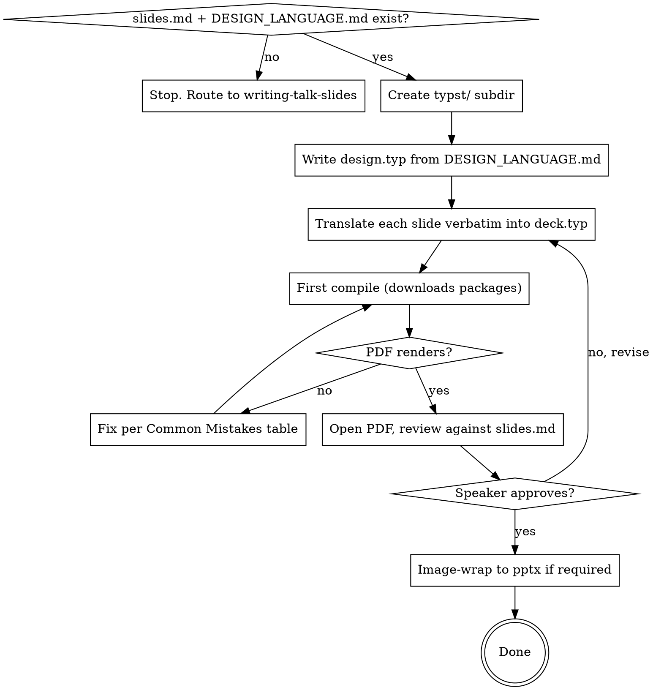

# Building Talk Decks with Typst + Touying

## Overview

Compile `slides.md` (per-slide spec) into a rendered PDF deck using Typst + Touying. The deck is the authoritative *visual* artifact; `slides.md` remains the spec. If pptx is required for conference delivery, the PDF is image-wrapped into a pptx at the end — the pptx is the deliverable, not the source.

**Why Typst + Touying** (over python-pptx, Marp, or hand-built PowerPoint):

- Architecture diagrams with step-by-step reveals expressed in ~3 lines per step (one source, conditional drawing keyed on subslide index).
- Fast compile loop, real layout primitives, programmatic figures stay programmatic.
- Tradeoff: pptx output is image-wrapped (non-editable). PDF is editable in Typst, not in PowerPoint.

## When to Use

- A validated `slides.md` exists (from `writing-talk-slides`) AND `DESIGN_LANGUAGE.md` exists.
- Speaker is moving from spec to rendered deck.
- Existing python-pptx pipeline is being replaced OR no pipeline exists yet.

**Do NOT use** for:
- Writing or revising `slides.md` (use `writing-talk-slides`).
- Polishing in PowerPoint after the build (out of scope; rebuild instead).
- Talks where the venue requires *editable* pptx — the image-wrapped output won't satisfy that.

## Required Prior State

The talk directory must contain:

- `concept.md` — talk concept
- `DESIGN_LANGUAGE.md` — palette, typography, layout, slide types, don'ts
- `slides.md` — per-slide spec with Type / Visual / Layout / Speaker notes / Time
- `figures/` (if `slides.md` references programmatic figures — `.d2`, `.py`) and `figures/out/` SVGs already built

If any of these are missing, stop and route to the upstream skill.

## Project Layout

Create a `typst/` subdirectory in the talk directory:

```
talk/
  concept.md
  DESIGN_LANGUAGE.md
  slides.md
  figures/
    diagrams/*.d2
    charts/*.py
    out/*.svg                 # pre-built from sources
  typst/
    design.typ                # design constants — mirrors DESIGN_LANGUAGE.md
    deck.typ                  # the deck itself
    build.sh                  # PDF + optional pptx wrap
    deck.pdf                  # build output
    deck.pptx                 # optional final deliverable
```

Never inline the palette, fonts, or sizes inside `deck.typ`. Put them in `design.typ` and import. The design doc is still the source of truth — `design.typ` is a translation, not a fork.

## Core Pattern — `design.typ`

```typst
// Mirrors DESIGN_LANGUAGE.md. If they drift, the design doc wins.

#let palette = (
  black:         rgb("#000000"),
  white:         rgb("#FFFFFF"),
  primary-dark:  rgb("#170F61"),     // section dividers only
  accent-purple: rgb("#6B37C3"),     // max one per slide
  red:           rgb("#CC0000"),     // failure / pain only
  light-grey:    rgb("#EBEBEB"),
  medium-grey:   rgb("#999999"),
)

#let font = "Helvetica Neue"

#let sizes = (
  headline:      36pt,
  body:          20pt,
  caption:       12pt,
  big-number:    140pt,
  divider-title: 56pt,
  statement:     40pt,
  title-large:   72pt,
)

#let margins = (top: 0.83in, bottom: 0.83in, left: 0.83in, right: 0.83in)
```

## Core Pattern — `deck.typ` skeleton

```typst
#import "@preview/touying:0.6.1": *
#import themes.simple: *
#import "@preview/cetz:0.3.4"
#import "design.typ": palette, font, sizes, margins

#show: simple-theme.with(
  aspect-ratio: "16-9",
  config-info(title: [Talk Title], author: [Speaker]),
  config-page(margin: margins, fill: palette.white),
  // CRITICAL: suppress theme chrome — almost every minimalist design doc forbids it
  progress-bar: false,
  footer: [],
  footer-right: [],
)

#set text(font: font, size: sizes.body, fill: palette.black)
```

### The four chrome-suppression incantations

`simple-theme` shows a progress bar AND a page counter ("3 / 12") by default. These violate any minimal design language. You need **all three** of these in `simple-theme.with(...)`:

- `progress-bar: false`
- `footer: []`
- `footer-right: []`

Just `footer: []` alone leaves the page counter. Just `progress-bar: false` alone leaves both footers.

## Core Pattern — Static Slides

### Title

```typst
#slide[
  #v(1.2fr)
  #text(size: sizes.title-large, weight: "regular")[Talk Title]
  #v(0.3em)
  #text(size: 18pt, weight: "light", fill: palette.medium-grey)[Subhead]
  #v(3fr)
]
```

### Big number

```typst
#slide[
  #v(1fr)
  #align(center, stack(
    spacing: 0.6em,
    text(size: sizes.big-number, weight: "bold")[5×],
    text(size: 16pt, weight: "light", fill: palette.medium-grey)[Caption],
  ))
  #v(1.4fr)
]
```

**Why `stack()` not raw `align(center)[...]`:** `align(center)[#text(big)[X] #v(0.6em) #text(cap)[Y]]` does NOT keep the caption near the number — `v()` inside `align` doesn't anchor as expected. Use `stack(spacing: ..., a, b)` to keep them visually adjacent.

### Statement

```typst
#slide[
  #v(1fr)
  #block(width: 75%)[
    #text(size: sizes.statement, weight: "regular")[
      One quotable sentence, left-aligned, surrounded by white space.
    ]
  ]
  #v(1.2fr)
]
```

## Core Pattern — Architecture Diagram with Progressive Reveals

This is the highest-value pattern in the skill. Express the diagram **once**, gate elements on `step >= N`, drive `step` from Touying's `self.subslide`.

```typst
#let arch-canvas(step) = cetz.canvas({
  import cetz.draw: *

  let stroke-default = (paint: palette.black, thickness: 1pt)
  let stroke-grey = (paint: palette.light-grey, thickness: 1pt)
  let box(name, x, y, label, w: 2.4, h: 0.9) = {
    rect((x, y), (x + w, y + h), name: name, stroke: stroke-default)
    content((x + w/2, y + h/2), text(font: font, size: 11pt)[#label])
  }
  let arrow(from, to) = line(from, to,
    mark: (end: ">", fill: palette.black), stroke: stroke-default)

  // Container drawn first (sits behind) — only when revealed
  if step >= 5 {
    rect((-0.4, 3.0), (12.4, 4.4), stroke: stroke-grey)
    content((0.8, 4.15),
      text(font: font, size: 9pt, fill: palette.medium-grey)[Cloud tier])
  }

  // Step 1: always
  box("m1", 0, 0, [Machine 1])
  box("m2", 0, 1.2, [Machine 2])

  // Step 2+: Kafka with merging arrows
  if step >= 2 {
    box("kafka", 3.8, 0.6, [Kafka])
    arrow("m1.east", "kafka.west")
    arrow("m2.east", "kafka.west")
  }

  // ... step 3, 4, 5
})

#slide(repeat: 5, self => [
  #let s = self.subslide
  #text(size: sizes.headline, weight: "regular")[The system]
  #v(1fr)
  #align(center + horizon)[ #arch-canvas(s) ]
  #v(1fr)
  #text(size: sizes.caption, fill: palette.medium-grey)[Caption text]
])
```

**Why this works:**
- `slide(repeat: N, self => [...])` produces N PDF pages from one source.
- `self.subslide` is the 1-based index of the current sub-page.
- The closure form `self => [...]` is required to access `self`; the bracket form `slide[...]` does not expose it.
- Background containers must be drawn **before** foreground boxes (cetz paints in order).

## Build Script

```bash
#!/bin/bash
# build.sh — PDF + optional pptx wrap
set -e
cd "$(dirname "$0")"

typst compile deck.typ deck.pdf
echo "Built deck.pdf ($(wc -c < deck.pdf | awk '{print $1}') bytes)"

# Optional: image-wrap into pptx. The pptx is non-editable but conference-deliverable.
if [ "$1" = "pptx" ]; then
  typst compile --format png --ppi 150 deck.typ "build/slide-{n}.png"
  python3 wrap_to_pptx.py build/slide-*.png deck.pptx
  echo "Built deck.pptx"
fi
```

The `wrap_to_pptx.py` helper uses `python-pptx` with one full-bleed image per slide. Each PNG becomes one pptx slide. Speaker notes from `slides.md` can be injected separately.

## Faithful Translation of `slides.md`

Each slide in `slides.md` maps to exactly one `#slide[...]` block (or one `#slide(repeat: N, ...)` for progressive reveals). Headlines, body text, and captions come **verbatim** from the `Visual:` section of the spec. Do not paraphrase. Do not invent.

If `slides.md` says the headline is `"This talk is about everything this diagram doesn't show."`, that exact string appears in the Typst source. The spec is the contract.

## Common Mistakes

| Symptom | Fix |
|---|---|
| Page numbers visible bottom-right ("3 / 12") | Add `footer-right: []` in `simple-theme.with(...)`. `footer: []` alone is insufficient. |
| Progress bar visible at top | Add `progress-bar: false`. |
| Big-number slide caption floats to bottom of slide instead of near the number | Replace `align(center)[#text(...) #v(...) #text(...)]` with `align(center, stack(spacing: ..., ..., ...))`. |
| `self.subslide` undefined / error | Use closure form: `#slide(repeat: N, self => [...])`. The bracket form `#slide[...]` doesn't expose `self`. |
| Cetz container clips elements | Background containers must be drawn before foreground; cetz paints in source order. Move the `if step >= N { rect(...) }` for the container above the always-on boxes. |
| Headline wraps unexpectedly | Either reduce point size (60pt instead of 72pt) or widen via `block(width: 95%)`. Headlines should sit on ≤ 2 lines per the design doc; one is ideal. |
| Inventing colors / fonts / sizes in `deck.typ` | Stop. Open `design.typ`. If it's not there, open `DESIGN_LANGUAGE.md`. |
| Touying package download fails | First compile fetches `@preview/touying` and `@preview/cetz`. Re-run; the second compile uses the cache. |
| Helvetica Neue missing | On macOS it ships at `/System/Library/Fonts/HelveticaNeue.ttc`. Verify with `fc-list \| grep -i "helvetica neue"`. |

## Red Flags — STOP

| Thought | What it means |
|---|---|
| "I'll tweak the slide directly in the pptx" | The pptx is image-wrapped. Rebuild from Typst. |
| "I'll just pick a slightly different purple" | Open `DESIGN_LANGUAGE.md`. The palette is fixed. |
| "I'll paraphrase the headline to fit better" | Open `slides.md`. Strings are verbatim. If wrapping is the problem, change the size, not the words. |
| "I'll skip the design.typ file, just inline the constants" | The next slide will inline a slightly different value. Constants live in one place. |
| "I'll embed a PNG screenshot of the architecture diagram" | The whole point of this stack is `cetz`. Use it. |
| "Touying's `simple-theme` default chrome is fine" | The talk's design doc almost certainly forbids it. Suppress all three: `progress-bar`, `footer`, `footer-right`. |

## Workflow



## Terminal State

Skill ends when:

- `typst/deck.typ` compiles cleanly to `typst/deck.pdf`.
- Every slide in `slides.md` has a matching `#slide` block in `deck.typ`.
- All verbatim strings (headlines, captions, statements) match `slides.md` byte-for-byte.
- If pptx is required: `typst/deck.pptx` exists.

Do not advance to rehearsal, live demo wiring, or speaker-notes export from inside this skill — those are separate concerns.
