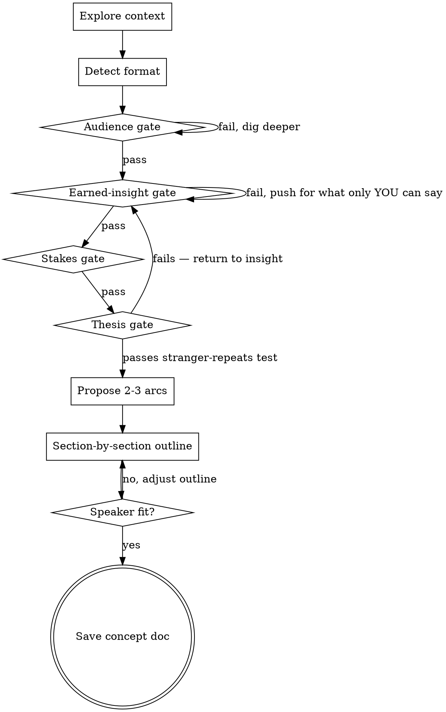

# Developing Conference Talks

## Overview

Help turn a rough talk idea into a validated talk concept through collaborative dialogue. One question at a time. Four gates the talk must pass before structure is proposed: **audience model, earned insight, stakes & tension, one-sentence thesis**. Section-by-section validation. Terminal output: a concept doc saved next to the talk.

<HARD-GATE>
Do NOT propose a narrative arc, draft an outline, or save a concept doc until all four gates have passed AND the user has approved each section. Skipping gates produces fuzzy talks. This applies to every talk regardless of perceived simplicity.
</HARD-GATE>

**You MUST NOT call `EnterPlanMode` or `ExitPlanMode`** during this skill. It runs in normal mode.

## When to Use

- Speaker has a topic and material but no validated thesis
- Speaker tends to want to "cover everything" — needs compression
- Risk of fuzzy thesis, surface-level insight, demo-parade structure, or wrong audience pitch
- Before any slide work begins

**Do NOT use** for: polishing finished slides, writing speaker notes, rehearsal feedback, or last-minute fixes. This skill is for the *concept*. If a concept doc already exists, read it and consult the user before re-running the gates.

## Anti-Pattern: "I Already Know My Talk"

Every talk goes through this process. "I've given this talk before," "the topic is obvious," "I just need help with structure" — these are exactly the situations where unexamined assumptions cause flat talks. The audience model still needs articulating. The insight still needs pressure-testing. Letter-of-the-rules and spirit-of-the-rules are the same here: gates fire on every talk.

## Checklist

Create a task for each item and complete in order:

1. **Explore context** — talk dir, prior decks, venue/audience notes, existing material
2. **Detect format** — confirm length and type (lightning / standard / keynote / workshop / panel)
3. **Audience model gate** — must pass before proceeding
4. **Earned-insight gate** — must pass before proceeding
5. **Stakes & tension gate** — must pass before proceeding
6. **One-sentence thesis gate** — must pass before proceeding
7. **Propose 2–3 narrative arcs** with trade-offs, recommend one
8. **Section-by-section outline** with per-section approval
9. **Speaker-fit check** before finalizing
10. **Save concept doc** to `<talk-dir>/concept.md`

## Process Flow

## The Four Gates

### 1. Audience Model Gate (FIRST, never last)
The speaker must articulate, in writing:
- **Who** — role, seniority, technical depth, tribe. **One persona, not two.** If the speaker names "senior + architects" or "engineers + PMs," that's a fail — talks pitched at two personas land at neither. Force them to name the single person they're most talking *to* (the one who walks up after and says "that was the talk I needed").
- **Why they came** — what they hoped to learn or feel
- **What they already know** about your topic (so you don't re-teach)
- **What they should feel leaving** — not just learn, *feel*
- **Genre saturation (own micro-gate)** — how many talks like this has this audience seen this year? Name the version they're tired of hearing. Name what makes yours different. **This sub-question is the most-skipped — do not skip it.** A talk that ignores genre saturation lands as another instance of the genre.

If any answer is "I don't know," dig until you do. **This gate runs before insight work**, because insight is shaped by audience.

### 2. Earned-Insight Gate
The talk must contain at least one insight only THIS speaker could deliver. Pressure-test with at least two of:
- "Could a smart engineer who hadn't lived this say it?" If yes, push deeper.
- "Is this insight in the first three Google results for the topic?" If yes, push deeper.
- "Say it in your own words, no jargon." Insight must survive being said plainly.
- "What's the version of this that would get pushback from the audience?" The earned version usually has an edge.

Accepting the first answer is the failure mode. Push at least once past the first articulation.

### 3. Stakes & Tension Gate
A talk without tension is a feature parade. The speaker must name:
- **What was at risk** — technically, organizationally, personally
- **The surprise** — what they expected vs. what happened
- **The conflict** — forces in opposition (speed vs. correctness, autonomy vs. coordination, etc.)

If "what could have gone wrong" has no answer, the talk has no stakes. Push for tension or reconsider the framing.

### 4. One-Sentence Thesis Gate
The thesis must:
- Fit in one sentence under 25 words
- Survive the **stranger-repeats test**: a non-expert in the hallway after the talk could repeat it accurately. Imagining a stranger is easy to fake — for high-stakes talks, ask the speaker to actually run it past a non-expert before the gate passes.
- Be specific enough to disagree with (not "X is hard" but "X breaks because Y, and the fix is Z")
- **Be the earned insight, said as a defensible claim.** Not "connected to" — *the same idea*. If the thesis and the earned insight (gate #2) read as two different ideas, one of them is wrong. Force the speaker to show the line: "the insight is X; the thesis is X stated as a claim someone could disagree with." If they can't draw the line, return to gate #2.

If thesis fails, return to the earned-insight gate. They are linked by design.

## Format Branches

After context exploration, branch the workflow:

| Format | Length | Adjustments |
|---|---|---|
| **Lightning** | 5–10 min | One beat only. Skip the 2-3 arcs proposal — there is one shape. Thesis under 15 words. One supporting point max. Cut everything else. |
| **Standard** | 20–45 min | Full flow as documented. 2–3 supporting points around one headline insight. |
| **Keynote** | 30–60 min | Full flow + thematic envelope (a frame larger than the technical story). Add a fifth gate: "what does this mean for the field?" |
| **Workshop kickoff** | 10–20 min | Replace narrative-arc phase with explicit *learning objectives*. End on agenda preview, not call-to-action. |
| **Panel intro / position** | 3–5 min | Skip arc, skip outline. Output is one provocative claim + one piece of evidence + invitation. Run only audience and thesis gates. |

If the user names a format not in this table, ask which row it most resembles before continuing.

## Dialogue Conventions

- **One question per message.** Never bundle.
- **Multiple choice when possible**, open-ended when judgment matters.
- **Validate per section.** Do not dump the full outline at once. Ask after each section: "does this look right so far?"
- **Detect rubber-stamping.** If the speaker approves 3+ sections in a row with zero revisions, pause and ask explicitly: *"Which of these sections feels weakest? If I'm wrong about any, this is the moment to say so."* Easy approvals during section-by-section validation often mean fatigue, not agreement.
- **Propose 2–3 alternatives** before settling on narrative arc. Lead with your recommendation and reasoning.
- **Name what you're cutting.** Every concept doc has a "cut list" — what NOT to include. Cuts are decisions, not omissions.

## Speaker-Fit Check (before saving)

Before finalizing the outline, ask explicitly:
- Can the speaker deliver the proposed opening (cold open, war story, data hook, etc.)?
- Does the structure match how they naturally explain things?
- Is there anything in the outline they'll feel uncomfortable saying?

If any answer is no, **adjust the outline, not the speaker.** A perfect concept the speaker can't deliver is worse than a B+ concept they can.

## Talk-Killers and Their Fixes

| Symptom | Fix |
|---|---|
| Speaker wants to "set up the company background" | Cut. Audience came for insight, not bio. |
| Full architecture diagram for 5 minutes | Cut to a simplified version showing only the parts in the story. |
| Thesis sounds like every other talk in the genre | Return to earned-insight gate. |
| Three "main lessons" all at the same level | Promote one to headline, demote others to supporting. |
| Cold open / dramatic structure proposed without checking speaker fit | Stop. Confirm the speaker can deliver it. |
| "I'll figure out the audience later" | No. Audience gate is first. |
| Speaker has lots of material and wants to use most of it | Material ≠ talk. Most material gets cut. |

## Red Flags — STOP and return to a gate

| Thought | Return to |
|---|---|
| "We can figure out audience later" | Audience gate |
| "The insight is good enough, let's move on" | Earned-insight gate (push at least once more) |
| "It's a feature parade but the features are interesting" | Stakes gate |
| "The thesis is two sentences, but they're short" | Thesis gate |
| "Let's just pick the arc, the speaker will adapt" | Speaker-fit check |
| "I'll save the concept doc now and refine later" | Whichever gate hasn't fully passed |
| "This speaker has given the talk before, gates aren't needed" | Run the gates anyway. Old talks rot. |
| "Two audience personas is fine, the talk works for both" | Audience gate. Force one persona. Two = neither. |
| "The thesis and the insight are different but related" | Thesis gate. They must be the same idea, restated as a claim. |
| "Speaker approved every section, we're done" | Rubber-stamping check. Force them to name the weakest section. |
| "Speaker-fit is fine, the outline is great" | Run the speaker-fit check anyway. It's the most-skipped step. |

## Saving the Concept Doc

Save to `<talk-dir>/concept.md`. If a `concept.md` already exists, save to `concept-YYYY-MM-DD.md` and tell the user both files exist.

The doc must include:
- Working title
- Format and length
- Audience model (full answers from gate 1, including genre saturation)
- Earned insight (one paragraph, plain language)
- Stakes / tension (one paragraph)
- One-sentence thesis (the version that passed the stranger-repeats test)
- Narrative arc chosen + the 1–2 alternatives that were rejected and why
- Section-by-section outline with rough timings
- Quotable lines to land
- Cut list (what's deliberately NOT in the talk)
- Open items for the speaker

## Terminal State

Skill ends when the concept doc is saved. **Do not** automatically draft slides, write speaker notes, or invoke other skills. The user decides when (and whether) to move on. If they ask for slides immediately after, treat it as a new request.
