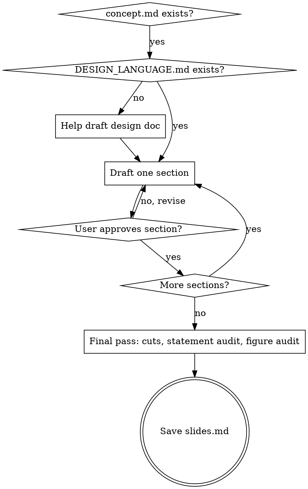

# Writing Talk Slides

## Overview

Translate an approved concept into `slides.md` — a per-slide spec with **Type / Visual / Layout / Speaker notes / Time**. Two principles run through every slide: **clear** (one idea, glance-readable) and **vivid** (concrete, named, sized). The skill is design-agnostic on visual choices but enforces two structural rules: a design language must exist before drafting, and every figure is programmatic.

**REQUIRED PRIOR STATE:** `concept.md` exists in the talk directory and has passed its gates (see `developing-conference-talks`). If it does not, stop and run that skill first.

## When to Use

- A validated `concept.md` exists and the speaker is moving to slides
- Building or rewriting a deck spec for a conference talk
- Handoff after `developing-conference-talks`

**Do NOT use** for: developing the concept itself, polishing finished slides, building the `.pptx`, or rehearsal feedback.

## Two Hard Gates (run BEFORE drafting any slide)

### Gate 1 — Design-Language Gate

A `DESIGN_LANGUAGE.md` must exist in the talk directory. **It is the source of truth for every visual decision.** If missing, help the speaker write one in a short pass before drafting slides.

It must specify, at minimum:

- **Palette** — colours with hex codes, and where each is used (default, accent, reserved-for-pain, caption, divider)
- **Typography** — font family + sizes per role (headline, body, caption, big-number, divider)
- **Layout** — canvas size, margins, alignment, one-idea-per-slide rule
- **Slide types taxonomy** — at minimum: Title, Statement, Big number, Diagram, Section divider, Closing
- **Diagram aesthetic** — line weight, fill rules, label rules
- **Don'ts** — explicit forbidden moves

The skill does NOT invent design decisions. It reads them. If you find yourself deciding a colour or font, stop and read the design doc.

### Gate 2 — Programmatic-Figures Gate

Every figure on every slide is generated from a source file committed alongside `slides.md`. Defaults:

| Figure type | Tool | Source | Output |
|---|---|---|---|
| Architecture / system / process diagram | **D2** | `.d2` in `figures/diagrams/` | SVG in `figures/out/` |
| Chart, plot, timeline, bar/line/scatter | **matplotlib** | `.py` in `figures/charts/` | SVG in `figures/out/` |
| Geographic / map | D2 or matplotlib | as above | SVG in `figures/out/` |

Slide specs reference the source file by path. **Forbidden:** hand-placed shapes in the slide tool, screenshots of dashboards or third-party diagrams, stock imagery, clip art, AI-generated decoration, pre-rendered images without a committed source.

If the design doc names different tools, follow the design doc. Absent that: D2 + matplotlib.

## Per-Slide Spec Format

Every slide entry uses this shape:

```markdown
## Slide N — [short title]

**Type:** [one of the design-doc slide types]

**Visual:**
- [What appears on the slide. Quoted text is exact wording. Reference figure source files by path: `figures/diagrams/checkout-flow.d2`.]

**Layout:**
- [Only non-default positioning, sizing, or colour. If default per design doc, write "default per design doc".]

**Speaker notes (T:MM:SS):**
- [Directional. 2–5 lines. Key delivered lines in quotes. Not a verbatim script.]
```

`T:MM:SS` is cumulative talk time the slide should land at.

## The Four Pushes — Clear and Vivid

Apply on every slide, every pass.

### 1. Cut ruthlessly

Default is to remove. A slide must earn its place. Cuts happen *during* drafting, not as an emergency option if running long.

Cut by default: agenda slides, mid-talk recap slides, "thank you for listening" slides, sponsor/bio padding, "for completeness" slides, anything restating what the speaker is saying out loud.

Healthy slide count: roughly the number of distinct beats in the concept doc, ±20%. Higher means you padded.

### 2. Concrete over abstract

Never write a generic placeholder when the concept doc names a real thing.

| Avoid | Prefer |
|---|---|
| "A downstream service" | "the payments service" |
| "Significant improvement" | "−40% in 4 months" |
| "Multiple teams" | "three teams: cache, payments, search" |
| "An alert" | The real alert text in a monospace block |
| "A chart of results" | The actual matplotlib figure with the real numbers |

### 3. One idea per slide

If a slide has two ideas, split it. Bullet lists are a smell — they are usually multiple slides smashed into one. **No bullet lists**, with one exception: an explicit prescription / steps slide, used at most once in the deck.

If you find yourself writing a table with more than one row of meaningful comparison, ask whether each row deserves its own moment.

### 4. Statement slides for punchlines

Every quotable line from the concept doc becomes a full **statement slide** unless the speaker explicitly cuts it. They are typographically simple — headline-weight text, lots of white space, no decoration — and they get held.

Not labels on other slides. Full slides.

## Don't Invent Facts

The concept doc is the source of truth for *what the talk says*. The skill shapes *how it lands on slides*. If a slide needs a number, name, or quote that the concept doc doesn't contain:

- **Mark it `[SPEAKER: provide]`** in the slide spec.
- **Do not invent** even "directionally true" or "illustrative" numbers.
- Do not promote a hypothetical example into a stated fact.

The audience cannot tell which numbers you made up. The speaker can. One invented number poisons trust in the deck.

## Speaker-Notes Style

Directional, 2–5 lines per slide. A good note tells the speaker:

- The intent of this slide ("land the admission; don't soften")
- The one delivered line that must be precise (in quotes)
- Beats / silences / cues if non-obvious

| Bad (script) | Good (direction) |
|---|---|
| "Say: 'We ran a 14-month latency program. Every engineer involved was good. Every fix landed. This is what we got.' Pause on the −5%. Most of the room has shipped something like this." | "Open with the failed-program admission. Key line: *'The program failed.'* — don't soften. Hold the −5%." |

If speaker notes run longer than 5 lines, you wrote a script. Compress to direction.

## Workflow



### Section-by-section drafting

- Draft **one section at a time**, then show it. Ask: "approve or revise?"
- **Never dump the whole deck.** The concept doc was validated section-by-section; slides are too.
- **Rubber-stamp check:** if the speaker approves 3+ sections in a row with no edits, pause and ask which feels weakest. Easy approvals are usually fatigue, not agreement.

### Final pass (before saving)

1. **Slide count vs. beats** — within ±20% of the concept doc's distinct beats. If higher, cut.
2. **Statement-slide audit** — every quotable line from the concept doc has a statement slide or an explicit decline.
3. **Figure audit** — every diagram has a `.d2` source on disk; every chart has a `.py` source on disk; both referenced by path.
4. **No bullet lists** — scan `Visual:` blocks. Convert any survivors to splits, columns, or a single concrete artefact.
5. **Speaker notes ≤ 5 lines each.**

## Common Mistakes

| Symptom | Fix |
|---|---|
| Drafting all slides before user reviewed any | Stop. Show one section. Ask. |
| Inventing a palette, font, or slide type | Stop. Read DESIGN_LANGUAGE.md or write it first. |
| Speaker notes are paragraphs | Compress to direction. One must-deliver line in quotes max. |
| Slide has 3+ bullets | Split into 3 slides, or convert to one concrete artefact. |
| Diagram described in prose only | Add the `.d2` source path. Create the file if absent. |
| Chart inserted as a screenshot | Replace with a matplotlib script in `figures/charts/`. |
| Quotable concept line has no statement slide | Add one. |
| Slide exists "for completeness" or "in case someone asks" | Cut. Put in a backup-slides section if truly needed. |
| Title slide has bio / affiliations beyond name + venue | Cut down to the design-doc title format. |
| Closing slide says "Thanks / Questions?" | Replace with the talk's closing thesis line. Thank-you is spoken. |
| Inventing illustrative numbers not in concept doc | Mark `[SPEAKER: provide]`. |

## Red Flags — STOP

| Thought | What it means |
|---|---|
| "I'll pick a palette / font / slide layout" | You are inventing design. Read DESIGN_LANGUAGE.md or write it first. |
| "I'll insert a screenshot of the diagram" | Write the D2 source instead. |
| "I'll just embed the chart image" | Write the matplotlib script instead. |
| "I'll dump all slides and let the speaker prune" | Section-by-section. No exceptions. |
| "This number isn't in the concept but it's directionally true" | Mark `[SPEAKER: provide]`. Do not invent. |
| "Speaker needs full sentences to read" | Directional only. The speaker is not reading aloud. |
| "Bullets are fine for this one slide" | One list-slide max in the entire deck, and only if it earns it. |
| "The speaker approved every section, we're done" | Run the rubber-stamp check. Force a "weakest section" answer. |

## Saving slides.md

Save to `<talk-dir>/slides.md`. If a `slides.md` already exists, save to `slides-YYYY-MM-DD.md` and tell the user both files exist.

The file must include:

- **Front matter** — talk title, venue, format, slide count, references to `concept.md` and `DESIGN_LANGUAGE.md`, design constants summary (one line)
- **Section headers** matching the concept doc
- **Per-slide entries** in the spec format above
- **Production notes** at the bottom — things to rehearse, things to cut first if running long (with named slide numbers), backup slides held off-deck
- **Figure index** — list of every figure source file under `figures/` referenced by the deck

## Terminal State

Skill ends when `slides.md` is saved AND every referenced figure source file (`.d2`, `.py`) exists on disk. **Do not** build the `.pptx`, render visuals, or rehearse delivery — those are separate steps. If the user asks for a deck build immediately after, treat it as a new request.
